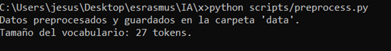

# Proyecto de Autocompletado de Código Python

Este proyecto utiliza aprendizaje automático con PyTorch y un modelo basado en transformadores para desarrollar una herramienta de autocompletado de código Python.

## Requisitos

1. **Python 3.x**.
2. Bibliotecas: PyTorch, numpy, pandas, matplotlib, transformers.

## Instrucciones

1. **Instalar dependencias**:
// 


```
pip install -r requirements.txt
```

2. **Preprocesar los datos**:
// 

Ejecutar el script de preprocesamiento:

```
python scripts/preprocess.py
```

3. **Entrenar el modelo**:

```
python scripts/train.py
```

4. **Evaluar el modelo**:

```
python scripts/evaluate.py
```

5. **Inferencia**:

Ejecutar el script de inferencia:

```
python scripts/infer.py --input "def mi_funcion("
```

## Estructura del Proyecto

```
code_autocomplete_project/
│
├── README.md             # Este archivo
├── requirements.txt      # Lista de dependencias
├── data/                 # Carpeta para datos
├── models/               # Modelos preentrenados y configuraciones
├── notebooks/            # Notebooks de análisis (opcional)
├── scripts/              # Scripts para preprocesamiento, entrenamiento, evaluación, inferencia
└── tests/                # Pruebas unitarias

